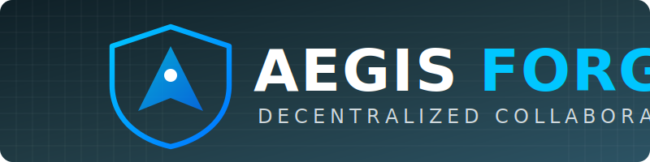
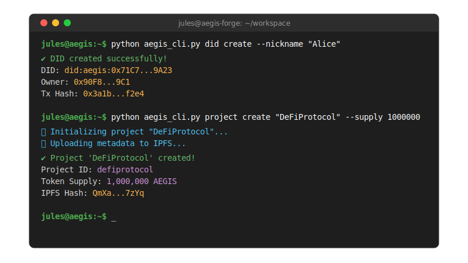

# Aegis Forge




## 📄 Visão Geral

**Aegis Forge** é uma plataforma descentralizada para gestão de projetos e colaboração. O sistema permite que desenvolvedores e criadores gerenciem identidades, projetos e contribuições de forma segura e transparente, utilizando tecnologia blockchain e armazenamento distribuído.

### Principais Funcionalidades

*   **Identidade Descentralizada (DID):** Criação e gestão de identidades soberanas na blockchain.
*   **Gestão de Projetos:** Criação de projetos com tokenomics própria e armazenamento via IPFS.
*   **Fluxo de Contribuição:** Submissão, revisão e recompensa de contribuições de código ou conteúdo.
*   **Mensageria P2P:** Comunicação criptografada ponta-a-ponta entre colaboradores.
*   **Token da Plataforma ($AEGIS):** Token utilitário para operações no ecossistema.

---

## 🏗 Arquitetura do Sistema

O diagrama abaixo ilustra como os componentes do Aegis Forge interagem:


---

## 🚀 Instalação e Configuração

Siga os passos abaixo para configurar o ambiente de desenvolvimento local.

### Pré-requisitos

*   **Python 3.8+**
*   **Node.js & npm** (para Ganache)
*   **IPFS Desktop ou CLI**

### 1. Instalar Dependências

Instale as bibliotecas Python necessárias:

```bash
pip install click ipfshttpclient web3 eciespy eth-keys cryptography
```

Instale o Ganache globalmente (opcional, se não usar a versão GUI):

```bash
npm install ganache --global
```

### 2. Configurar IPFS

Inicialize e inicie o daemon do IPFS em um terminal separado:

```bash
ipfs init
ipfs daemon
```

### 3. Iniciar Blockchain Local

Inicie o Ganache em outro terminal:

```bash
ganache
```
*Note o endereço RPC (geralmente `http://127.0.0.1:8545`).*

### 4. Executar Testes

Para garantir que tudo está funcionando:

```bash
chmod +x run_tests.sh
./run_tests.sh
```

---

## 💻 Guia de Uso (CLI)

A interação principal é feita através do script `aegis_cli.py`.



Abaixo estão exemplos de uso detalhados.

### Gestão de Identidade (DID)

Crie sua identidade na rede.

```bash
python aegis_cli.py did create --nickname "Alice"
```

**Saída:**
```text
DID created for Alice: did:aegis:0x1234...abcd
Transaction hash: 0xabcd...1234
```

### Gestão de Projetos

Crie um projeto e defina o supply inicial de tokens.

```bash
python aegis_cli.py project create "DeFiProtocol" --owner-did did:aegis:0x1234...abcd --supply 1000000
```

**Saída:**
```text
Project 'DeFiProtocol' created successfully.
Project ID: defiprotocol
Owner: did:aegis:0x1234...abcd
Token Supply: 1,000,000
Metadata IPFS Hash: QmHash...
```

### Contribuições

Submeta uma contribuição para um projeto existente.

```bash
python aegis_cli.py contribution submit defiprotocol \
    --contributor-did did:aegis:0x5678...efgh \
    --title "Fix Bug #42" \
    --description "Correção de vulnerabilidade no contrato." \
    --file ./patch.zip
```

**Saída:**
```text
Contribution submitted!
Proposal ID: prop-987654321
Status: Pending
IPFS Hash: QmPatchHash...
```

O dono do projeto pode então revisar e recompensar:

```bash
python aegis_cli.py contribution review prop-987654321 \
    --reviewer-did did:aegis:0x1234...abcd \
    --status approved \
    --reward 500
```

### Mensageria Segura (P2P)

Inicie um servidor para receber mensagens:

```bash
python aegis_cli.py p2p start-server --port 8000
```

Envie uma mensagem criptografada para outro par:

```bash
python aegis_cli.py p2p send-message --target-ip 127.0.0.1 --target-port 8000 --message "Olá, mundo descentralizado!"
```

---

## 📂 Estrutura do Projeto

```text
.
├── aegis_cli.py                # Ponto de entrada da CLI
├── did_system.py               # Lógica de Identidade (DID)
├── project_management.py       # Gestão de Projetos e Tokens
├── contribution_workflow.py    # Sistema de Contribuições
├── ipfs_storage.py             # Integração com IPFS
├── p2p_messaging.py            # Camada de Mensageria Criptografada
├── platform_token.py           # Gestão do Token $AEGIS
├── AegisToken.sol              # Smart Contract do Token (Solidity)
├── DIDRegistry.sol             # Smart Contract de Registro DID (Solidity)
└── contracts/                  # ABIs e Bytecodes compilados
```

---

## 🤝 Contribuindo

Contribuições são bem-vindas! Por favor, leia o arquivo `contribution_workflow.py` para entender como o sistema gerencia as próprias contribuições (dogfooding).

1.  Faça um Fork do projeto
2.  Crie sua Feature Branch (`git checkout -b feature/AmazingFeature`)
3.  Commit suas mudanças (`git commit -m 'Add some AmazingFeature'`)
4.  Push para a Branch (`git push origin feature/AmazingFeature`)
5.  Abra um Pull Request

---

## 📜 Licença

Distribuído sob a licença MIT. Veja `LICENSE` para mais informações.

---

## 🌐 Conecte-se comigo

*   **Instagram:** [jailton_fon](https://instagram.com/jailton_fon)
*   **Facebook:** [Jailton Fonseca](https://facebook.com/jailton.fonseca.507)
*   **TikTok:** [@fonsecac41](https://tiktok.com/@fonsecac41)
*   **Twitch:** [fonsecac41](https://twitch.tv/fonsecac41)
*   **YouTube:** [@JailtonFonseca](https://www.youtube.com/@JailtonFonseca)

📍 **Brasil** 🇧🇷

---

**Desenvolvido por Jailtonfonseca**

## 🌐 Conecte-se comigo

*   **Instagram:** [jailton_fon](https://instagram.com/jailton_fon)
*   **Facebook:** Zfonseca
Julio Fonseca - fonseca@123.com
*   **TikTok:** [@fonsecac41](https://tiktok.com/@fonsecac41)
*   **Twitch:** [fonsecac41](https://twitch.tv/fonsecac41)
*   **YouTube:** [@JailtonFonseca](https://www.youtube.com/@JailtonFonseca)

📍 **Brasil** 🇧🇷

---

**Desenvolvido por Jailtonfonseca**
